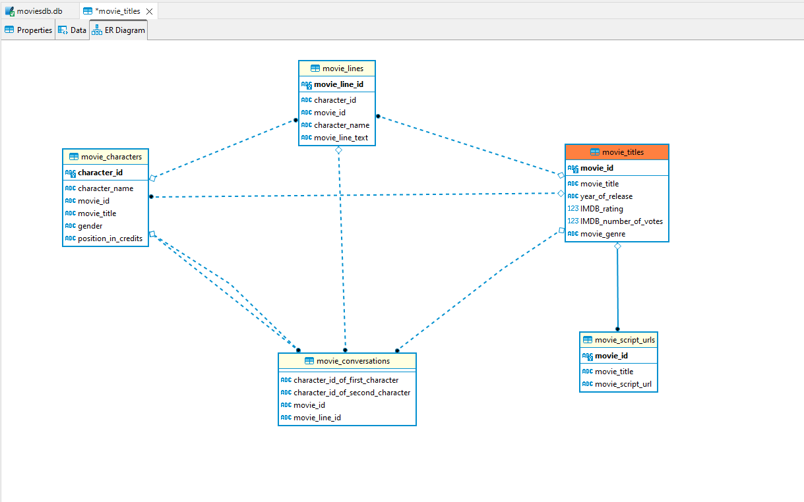

Work in progress.  
The intent of this repo is to use OpenAI for question Answering based on a custom database and few other retrieval based question answering tasks.  
The movie-dialog-corpus from cornell is used and its pre-processing is done along with its conversion to a relational SQL database along with constraints like primary key, foreign key etc.  

Preprocessing is complete and the database is exported as a SQLite database in database directory. Notebook is available in notebooks directory.

### How to view database and tables via database explorer
SQLite database file moviesdb.db can be viewed by using a viewer for SQLite database such as https://sqlitebrowser.org/  

### How to view database in python
To view database in python, run the below code in same directory as database
```
import sqlite3
import pandas as pd
con = sqlite3.connect("moviesdb.db")
df = pd.read_sql_query("SELECT * from movie_titles", con)
```

ER Diagram of the database is below: -
